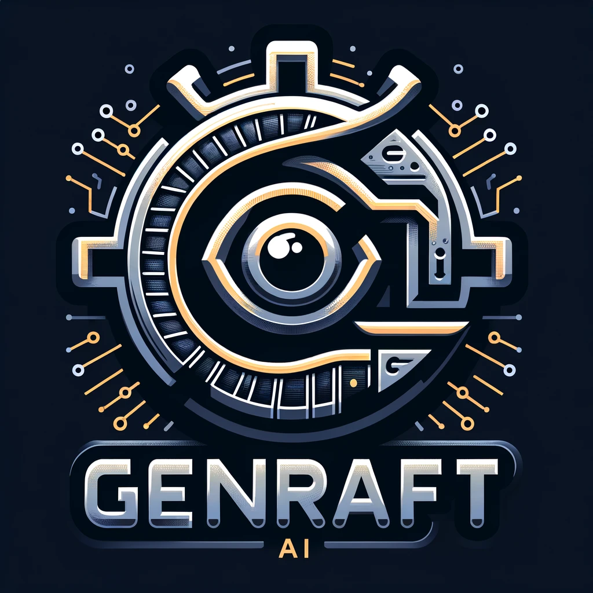

# Genraft AI

<div style="text-align: center;">
  
</div>

## Introduction

The Genraft AI Toolkit is a dynamic resource for creating sophisticated backend and frontend web solutions, utilizing the power of Python and the official OpenAI API to develop conversational agents. This toolkit harnesses the capabilities of generative AI to facilitate the development of responsive and intelligent agent interactions.

## Features

- Direct integration with the official OpenAI API to enable advanced conversational capabilities.
- Comprehensive backend and frontend development modules tailored for web applications.
- A user-friendly interface for easy management and interaction with the AI models.
- Highly extendable and customizable to cater to diverse web development needs.
- Focuses on accelerating the development cycle of web-based platforms with AI-driven interactions.

## Getting Started

### Prerequisites

- Python (version 3.7 or later)
- Access to OpenAI API (API keys)
- Basic knowledge of web development frameworks (e.g., Flask, Django, React, Vue.js)

### Installation

#### Clone

```bash
https://github.com/kamyabnazari/genraft-ai.git
```

#### Setup

##### Environment variables

Create a `.env` file in the root of the genraft-ai directory with the following variables or export in the terminal:

```
OPENAI_API_KEY={your openai api key}
```

##### Running the framework

To install the required packages for this plugin and run the service locally, run the following command:

```
pip install -r requirements.txt
```

To run the application, run the following command:

```
python3 app/main.py
```

#### Testing
[Outline the testing framework for both backend and frontend components]

[Include sample test cases and instructions for continuous integration practices]

### License
This project is licensed under the [Apache-2.0 license] License - see the LICENSE file for details.

### Acknowledgments

Special thanks to the OpenAI team for providing the API that powers our intelligent agents.

Additionally inspired by [ChatDev]("https://github.com/OpenBMB/ChatDev")